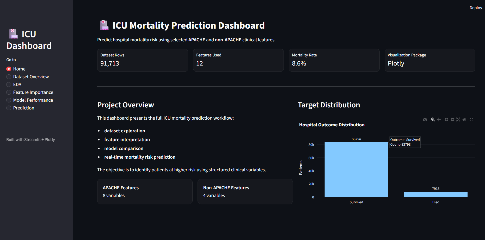

# UMBC DATA 606 Capstone Project

This repository is created for the DATA 606 Capstone course at UMBC.

## Project Title
# Early Prediction of ICU Patient Mortality Using Machine Learning

Prepared for  
UMBC Data Science Master’s Degree Capstone  
Instructor: Dr. Chaojie (Jay) Wang  

---

## Author

**Siva Ram Potluri**  
Spring 2026  

---

# Project Overview

This project focuses on predicting ICU patient mortality using machine learning techniques applied to structured clinical healthcare data.

The primary goal is to identify high-risk ICU patients early using demographic information, laboratory measurements, physiological indicators, and APACHE severity-related variables.

The project includes:

- Exploratory Data Analysis (EDA)
- Data preprocessing and feature engineering
- Machine learning model development
- Model evaluation and comparison
- Interactive Streamlit dashboard deployment

---

# Project Links

## Final Report

[View Final Report](docs/report.md)

---

## PowerPoint Presentation

[View PowerPoint Presentation](docs/ICU_Modern_Final_Presentation.pptx)

---

## PDF Presentation

[View PDF Presentation](docs/ICU_Modern_Final_Presentation.pdf)

---

## YouTube Presentation

https://youtu.be/jgckIwF5dKs

---

# Repository Structure

```text
UMBC-DATA606-Capstone/
│
├── data/
├── docs/
├── notebooks/
├── streamlit_app/
├── README.md
└── .gitignore
```

---

# Dataset

Dataset used:

**WiDS Datathon 2020 ICU Mortality Prediction Dataset**

https://www.kaggle.com/competitions/widsdatathon2020/data

The dataset contains ICU patient records including:

- Demographics
- Vital signs
- Laboratory values
- Comorbidities
- APACHE severity indicators

Target variable:

- `hospital_death`
  - `0` → Survived
  - `1` → Died

---

# Exploratory Data Analysis (EDA)

EDA was conducted to:

- Analyze missing values
- Understand class imbalance
- Visualize feature distributions
- Identify relationships between variables
- Detect mortality-related clinical patterns

## Key Findings

- APACHE-related variables were highly predictive
- Mortality cases were significantly imbalanced
- Kidney-related variables showed strong separation between outcomes
- Combining APACHE and non-APACHE features improved performance

---

# Machine Learning Models

The following models were evaluated:

- Logistic Regression
- Random Forest
- Gradient Boosting

Three feature configurations were tested:

1. APACHE-only features
2. Non-APACHE-only features
3. Combined feature sets

---

# Final Model Performance

## Final Selected Model

### Gradient Boosting with Combined Features

| Metric | Score |
|---|---|
| ROC-AUC | 0.8631 |
| Precision | 0.6990 |
| Recall | 0.2186 |
| F1 Score | 0.3330 |

---

# Streamlit Dashboard

An interactive Streamlit dashboard was developed for real-time ICU mortality prediction.

Dashboard capabilities include:

- Real-time mortality prediction
- Mortality probability gauge chart
- Interactive EDA visualizations
- Feature distribution analysis
- Patient comparison insights
- Prediction summary metrics

---

## Streamlit Dashboard Screenshot



---

# Technologies Used

- Python
- Pandas
- NumPy
- Scikit-learn
- Plotly
- Streamlit
- Jupyter Notebook

---

# Run the Streamlit App

```bash
cd streamlit_app
python -m streamlit run app.py
```

---

# Future Improvements

Possible future enhancements include:

- Deep learning-based ICU prediction models
- Time-series physiological modeling
- Real-time hospital system integration
- Explainable AI techniques such as SHAP and LIME
- Expanded dashboard analytics and deployment

---

# Conclusion

This project demonstrates the effectiveness of machine learning techniques in predicting ICU patient mortality using structured healthcare data.

Gradient Boosting with combined APACHE and non-APACHE features achieved the best overall predictive performance, while the Streamlit dashboard provides an interpretable and interactive interface for real-time clinical risk prediction.

---
